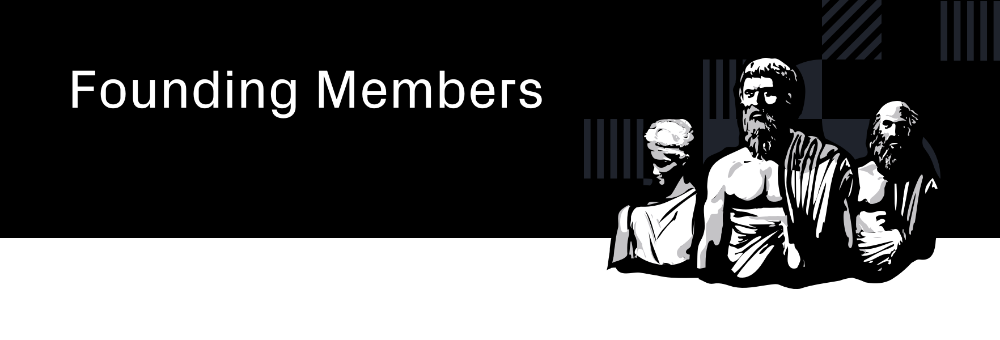

  <h3>A repo to organize information about the Founding Member program.<h3>

  <h4>
    <a href="/RULES.md">
      Rules
    </a>
     | 
    <a href="https://www.joystream.org/founding-members/">
      Website
    </a>
     | 
    <a href="/scoring-periods/15.md">
      Period Announcement
    </a>
     | 
    <a href="/inducted/README.md">
      Current Founding Members
    </a>
  </h4>

 

Table of Contents
==

<!-- TOC START min:1 max:3 link:true asterisk:false update:true -->
- [Overview](#overview)
  - [Scoring Periods](#scoring-periods)
  - [Referral Program](#referral-program)
- [Useful Resources](#useful-resources)
  - [Website and Leaderboards](#website-and-leaderboards)
  - [Program Rules](#program-rules)
    - [Current Period](#current-period)
  - [Submission Guidance](#submission-guidance)
  - [Scoring Guidance](#scoring-guidance)
  - [Questions and Concerns](#questions-and-concerns)
<!-- TOC END -->

# Overview

While Jsgenesis is the team currently building the technology behind the Joystream project, we will not be around forever, and we are instead entrusting the future operation of the Joystream DAO to our community members.

The Founding Member Program formally allocates JOY tokens among some of our highest quality community members in recognition of their contributions to the project and ensures that a sufficiently large, effective and motivated community of users is ready to occupy all the different roles required to run, evolve and grow the platform on mainnet.

This repo contains important data about the state of the program, including the rules, current members, guidance on scoring and submissions, and more.

The program is intended to run until the platform is ready to go live on mainnet. However, some changes in structure along the way must be expected.

## Scoring Periods

A scoring period is a term defined by a start and end date. Note down all of your actions that you think will qualify for [points](#scoring-guidance), and [submit them](#submission-guidance) after the period has ended.

Within a week of the end of a scoring period, Jsgenesis will review and "grade" all [submissions](#submission-guidance) in the inbox, and update the website with the most recent scores. If anyone reaches the internal threshold to become a Founding Member they will be inducted. You can read about the previous and current scoring periods below.

We are targeting two-week long scoring periods at the moment, but this may change in the future.

Some important considerations:
- Although you can submit for multiple scoring periods in the same form, we encourage you send them as soon as possible after the end of each, to reduce the chance of you forgetting something, and avoid large backlogs.
- Once you submitted for a scoring period `n`, you can no longer submit`*` for scoring period `n` or `n-m`. So, make sure you've included _all_ of your activities up to that point.

`*` Jsgenesis will try to be helpful in the early stages, but in general, this will make it very hard to grade, as we'd need to go through all previous submissions to verify there was no double entry.

## Referral Program

A key part of the scheme is the referral program. The motivation behind this is to incentivize inducted or prospective Founding Members to get more people participating in the project. It works as follows:
1. Whenever someone [submits](/SUBMISSION-GUIDELINES.md) their scoring summary, they can list a referrer. This referrer must be identified by their `memberId` and `memberHandle`.
2. Each time a referred user submits and gets credited a "direct score" of `n` points, the referrer gets credited a "referral score" of `0.2*n`
3. The "total score" is simply the sum of "direct score" + "total score".

Note that:
- Although a referrer can have infinite referrals, a referred user can only have one referrer (and cannot be changed).
- The person referred does not lose anything by doing this, it simply means an extra `0.2*n` is generated for the referrer.

# Useful Resources
## Website and Leaderboards

[Our website](https://www.joystream.org/founding-members) is the first place to check out if you would like to see the current Founding Members and our [leaderboards](https://www.joystream.org/founding-members/leaderboards/) for both regular members, and those awarded the Founding Member status.

You can also easily submit your regular activity summaries on our website using our [submission form](https://www.joystream.org/founding-members/form/).

## Program Rules

The full rules of the Founding Member Program can be found [here](/RULES.md).

### Current Period

The current [Scoring Period #15](/scoring-periods/15.md) started on the 30th of August, and ends on the 13th of September.

<!--
FIXME
Note that we are still accepting summaries from Scoring Periods [#0](/scoring-periods/0.md), [#1](/scoring-periods/1.md) and [#2](/scoring-periods/2.md), but only where a report for these periods has not previously been submitted.
-->

## Submission Guidance

Activity summaries can be submitted using the [form on our website](https://www.joystream.org/founding-members/form), or by sending us an email.

You can find out how to do either of these and the accepted formats for submission [here](/SUBMISSION-GUIDELINES.md). This document also contains a template and exemplar activity summaries, to give you an idea of what we expect submissions to contain.

## Scoring Guidance

We have also added some guidance to highlight what we consider to be some of the highest value contributions towards the growth and success of the project.

Read the non-exhaustive list of potential contributions [here](/CONTRIBUTIONS.md).

## Questions and Concerns

You can ask questions about the Founding Member Program on our [official Discord server](https://discord.gg/DE9UN3YpRP).
